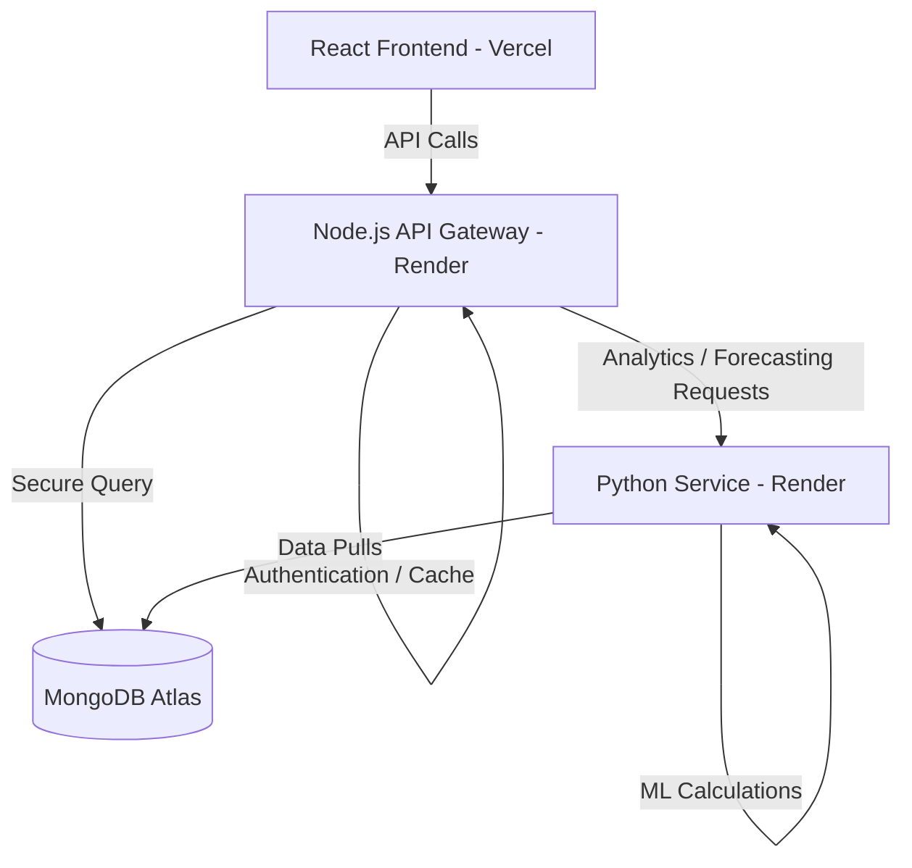

# FutureSkills-AI: AI Job Market Intelligence & Predictive Analytics Platform

**FutureSkills-AI** is a data-driven intelligence dashboard and predictive analytics platform. It aggregates, analyzes, and forecasts trends in global AI skill requirements, employment metrics, and market salaries to help developers, recruiters, and educators align with future demands.

---

## 🌐 Live Deployments

*   **Frontend Dashboard (Vercel):** [https://future-skills-ai.vercel.app](https://future-skills-ai.vercel.app)
*   **Node.js API Gateway (Render):** [https://futureskills-api-gateway.onrender.com](https://futureskills-api-gateway.onrender.com)
*   **Python Analytics Service (Render):** [https://futureskills-py-service.onrender.com](https://futureskills-py-service.onrender.com)

---

## 🎯 Use of this Project

This platform enables users to:
*   **Track AI Skill Demands:** Monitor the frequency and growth of critical tools like Python, SQL, Machine Learning, Deep Learning, and Cloud.
*   **Analyze Global Salary Ranges:** Keep track of market salary distributions across countries and experience levels.
*   **Forecast Hiring Trends:** Provide forward-looking, data-backed insights on job market volumes to make proactive career or hiring decisions.

---

## 🛠️ How it is Made & Workflow

The platform is built on a decoupled, microservices-oriented architecture:

*   **Frontend:** Built with **React** and **Vite** for the UI, styled using premium CSS, and utilizing **Recharts** for interactive data visualizations.
*   **API Gateway:** Developed using **Node.js** and **Express**. It handles rate limiting, user authentication (JWT + Bcrypt), and caches queries for 30 seconds to optimize performance.
*   **Analytics Engine:** Crafted with **FastAPI (Python)**. It processes aggregation pipelines directly from MongoDB Atlas and executes predictive forecasting models.
*   **Database:** A cloud-hosted **MongoDB Atlas** cluster storing cleaned, structured global job market listings.

---

## 📊 Insights of this Project

The dashboard generates real-time, high-impact intelligence from data:
*   **Market KPIs:** Instantly tracks total postings, global average salaries, top-hiring regions, and dominant roles.
*   **AI Skill Distribution:** Computes frequency charts to map the landscape of required developer technologies.
*   **Hiring Volumes & Trends:** Identifies monthly job posting trends to highlight seasonality and market expansion.
*   **14-Month ML Forecast:** Generates a predictive timeline for job openings using a Linear Regression model with confidence boundaries (95% CI) computed from time-series residuals.

---

## 🚀 How to Use It

1.  **Register / Log In:** Securely sign up or log in on the landing page to access the analytics workspace.
2.  **Explore the Dashboard:**
    *   **KPIs:** View general market conditions.
    *   **Interactive Charts:** Hover over the Recharts visualizations to inspect precise skill frequencies and trend coordinates.
    *   **Forecasting Tab:** Toggle metrics (such as jobs, salaries, or openings) to view historical data alongside the ML forecast and its confidence bounds.
3.  **Search & Filter:** Apply keywords, experience levels, or country filters. The URL query parameters sync in real time, making sharing specific filtered states simple.
4.  **Job Registry:** Navigate the paginated job table to inspect specific companies, salaries, locations, and industry domains.
