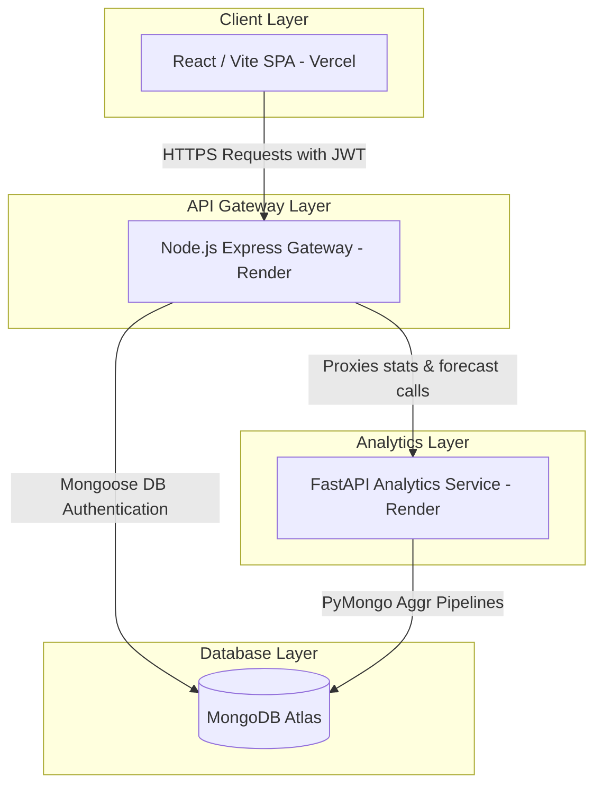

# FutureSkills-AI: Deep-Dive Technical Architecture & Data Analysis Report

This report provides a comprehensive, granular analysis of the **FutureSkills-AI** platform. It details the decoupled, multi-tier microservice architecture, the specific operations of each directory, the cell-by-cell workflows executed in the Jupyter Notebooks, and the statistical conclusions derived from the dataset.

---

## 🛠️ Section 1: Decoupled Multi-Tier Technical Architecture

FutureSkills-AI is built on a highly performant, decoupled microservices architecture designed to isolate frontend rendering, security/routing concerns, and database aggregations or predictive machine learning operations.

---

## 📂 Section 2: Detailed Folder Breakdown

### 1. `web/` (React Frontend Dashboard)
*   **Tech Stack:** React 19, Vite 8, Axios, React Router DOM 7, Recharts 3, and custom Vanilla CSS.
*   **Key Operations:**
    *   **App Routing (`App.jsx`):** Renders path `/` for `Login.jsx`, `/signup` for `Signup.jsx`, and `/dashboard` for the analytics workstation `Dashboard.jsx`.
    *   **Axios Interceptor (`services/api.js`):** Intercepts every outgoing HTTP request to check if a token exists in `localStorage`. If found, it automatically appends it to the `Authorization` header to authenticate request transactions.
    *   **Reusable UI Components (`components/`):**
        *   `KPI.jsx`: Renders cards containing title headings and key quantitative values.
        *   `SkillChart.jsx`: Implements a Recharts `BarChart` mapped to skills and posting frequencies. Equipped with responsive containers, custom tooltips, and rounded corners.
        *   `TrendChart.jsx`: Implements a multi-line Recharts `LineChart` graphing historical data (`value` - solid blue line), forecasted projections (`forecast` - dashed green line), and 95% Confidence Intervals (`lower`/`upper` bounds - thin dashed grey lines).
    *   **Interactive Dashboard (`pages/Dashboard.jsx`):**
        *   **URL State Synchronization:** Utilizes `useSearchParams` to sync the state of search inputs, selected country filters, and experience level filters directly with URL query parameters. This allows users to bookmark and share specific filtered views of the data.
        *   **Dynamic Data Querying:** Hits `/stats/summary`, `/stats/top`, `/stats/forecast` (defaulted to `jobs` and `horizon=14`), and `/stats/jobs` on component mount.
        *   **Data Aggregation & Prep:** Combines historical and forecast datasets into a single timeline array, aligning endpoints to provide continuous visual rendering.
        *   **Data Table Operations:** Implements interactive tabular sorting (clicking columns for sorting by Job Title, Salary, or Openings in ascending/descending order), global search filters, drop-down filters, and pagination limiting views to 8 items per page.

### 2. `api/` (Node.js API Gateway)
*   **Tech Stack:** Express 5, Morgan, Cors, Mongoose 9, jsonwebtoken 9, bcryptjs 3, node-cache 5, express-rate-limit 8.
*   **Key Operations:**
    *   **Global Rate Limiting (`server.js`):** Enforces a restriction limit of 100 requests per 15-minute window for security against Distributed Denial of Service (DDoS) and brute force attempts.
    *   **Database Schema (`models/User.js`):** Outlines user models with fields `name`, `email` (enforced as required and unique), `password`, and automatic mongoose timestamps.
    *   **Security Middleware (`middleware/auth.js`):** intercepts routes, extracts the token from the `Authorization` header, verifies the signature against `JWT_SECRET`, decodes payload fields, and attaches `req.user = decoded` to the request chain.
    *   **Authentication Routes (`routes/auth.js`):**
        *   `/signup`: Verifies email uniqueness, hashes user passwords with 10 salt rounds of `bcryptjs`, writes the model, and responds with `userId`.
        *   `/login`: Compares passwords via `bcryptjs.compare`, generates a signed token expiring in 7 days, and returns it.
        *   `/me`: Responds with active user details (name, email) while stripping out password hashes.
    *   **Analytics Controller Router (`routes/stats.js`):**
        *   Proxies endpoints to the Python microservice URL.
        *   **Memory Caching:** Instantiates a `node-cache` instance with standard Time-To-Live (stdTTL) of 60 seconds. Caches requests for `/summary`, `/trend`, `/top`, `/jobs`, and dynamic forecast params (e.g., `forecast_jobs_14`) to prevent duplicate database loads.
        *   Provides `DELETE /cache` route to flush cache instantly.
    *   **API Tests (`verify_endpoints.js`):** A custom Node script validating the entire backend flow (signup, login, summary fetch, forecast queries, and job registry) dynamically.

### 3. `py-service/` (Python Analytics & Forecasting Service)
*   **Tech Stack:** FastAPI, PyMongo, python-dotenv, NumPy, Pandas, scikit-learn.
*   **Key Operations:**
    *   **Ingestion Logic (`ingest/ingest_jobs.py`):** Opens clean jobs data, converts empty strings to `None`, casts integers and floats to proper types, flushes the MongoDB collection, and does a bulk insert of records.
    *   **App Service Setup (`app.py`, `db.py`):** Configures FastAPI with wild-card CORS middleware, connects to MongoDB Atlas using `pymongo.MongoClient` and maps the database `futureskills_ai`.
    *   **Database Statistics Endpoints (`routes/stats.py`):**
        *   `/summary`: Utilizes Mongo aggregation pipelines (`$group`, `$avg`, `$sort`, `$limit`) to return total job counts, overall average salaries, top country, and top job titles.
        *   `/trend`: Groups and counts job postings by `job_posting_year`.
        *   `/top`: Performs parallel counts of binary columns (Python, SQL, ML, Deep Learning, Cloud) and returns sorted arrays.
        *   `/jobs`: Performs pagination-less find query limited to the first 50 records.
        *   `/forecast`: Dynamic ML forecasting module (described below).

---

## 📊 Section 3: In-Depth Jupyter Notebook Analysis

The Python service directory includes notebooks in `notebooks/` where the initial data validation, cleaning, and exploratory data analysis (EDA) were conducted.

### Notebook 1: `01_dataset_exploration.ipynb`
*   **Goal:** Investigate raw dataset structure, shape, completeness, and values.
*   **Key Steps & Outputs:**
    1.  **Loading Data:** Loaded `ai_job_market.csv` into a Pandas DataFrame.
    2.  **Dataset Shape:** Verified dataset shape: **10,345 records across 19 columns**.
    3.  **Schema Check (`df.info()`):** Confirmed all 19 columns. 11 columns are numerical (`int64`), and 8 are categorical strings (`str`).
    4.  **Null-Value Check (`df.isnull().sum()`):** Confirmed **zero missing values** across all columns.
    5.  **Summary Statistics (`df.describe()`):**
        *   Average experience level: 6.95 years.
        *   Average market salary: $113,438.23.
        *   Job openings range between 1 and 9 (average 5 openings per posting).
        *   Skill binary columns (Python, SQL, ML, DL, Cloud) exhibit high variance with mean rates hovering around 49% - 51%.
    6.  **Frequency Counts:**
        *   *Job Titles:* Business Analyst (1773 postings), AI Engineer (1742), Machine Learning Engineer (1740), Data Analyst (1711), Data Scientist (1703), Data Engineer (1676).
        *   *Countries:* Germany (1498), Singapore (1490), Canada (1488), UK (1485), India (1470), USA (1459), Australia (1455).
        *   *Industries:* Technology (1787), E-commerce (1744), Finance (1724), Healthcare (1715), Education (1704), Retail (1671).

### Notebook 2: `02_data_cleaning.ipynb`
*   **Goal:** Deduplicate records, perform initial feature engineering, and verify pipeline connections.
*   **Key Steps & Outputs:**
    1.  **Deduplication:** Dropped duplicate records (`df.drop_duplicates()`).
    2.  **Null Handling:** Re-verified lack of nulls.
    3.  **Feature Engineering:**
        *   *`total_skills`:* Summed binary indicators: `skills_python` + `skills_sql` + `skills_ml` + `skills_deep_learning` + `skills_cloud` to capture candidate technical depth.
        *   *`posting_date`:* Concatenated `job_posting_month` and `job_posting_year` to create `MM-YYYY` string values.
    4.  **Data Export:** Exported cleaned DataFrame to `../data/processed/clean_jobs.csv`.
    5.  **MongoDB Connection Verification:** Loaded environment variables, instantiated a `MongoClient` connection, and listed databases to confirm database connectivity.

### Notebook 3: `03_advanced_analytics.ipynb`
*   **Goal:** Extract advanced insights (salary distributions by dimensions, skill impacts) and build the initial forecasting model.
*   **Key Steps & Outputs:**
    1.  **Average Salary by Country:**
        *   *Output:* Canada ($114,782.86), Singapore ($114,541.38), Australia ($114,367.36), USA ($113,280.96), UK ($112,722.33), India ($112,447.39), Germany ($111,938.02).
        *   *Storage:* Exported to `salary_country.json`.
    2.  **Experience vs Salary:**
        *   *Output:* Entry-Level ($89,095.87), Mid-Level ($113,592.02), Senior-Level ($138,289.09).
        *   *Storage:* Exported to `experience_salary.json`.
    3.  **Remote Work Style vs Salary:**
        *   *Output:* Onsite ($113,649.94), Hybrid ($113,363.76), Remote ($113,305.10).
        *   *Insight:* Negligible difference (~$300 range), showing flexible setups are compensated equally in the AI market.
        *   *Storage:* Exported to `remote_salary.json`.
    4.  **Skill Impact on Salaries:**
        *   *Output:* Deep Learning ($121,080.10), Machine Learning ($120,625.52), Cloud ($118,154.01), Python ($113,741.71), SQL ($113,329.87).
        *   *Insight:* High-level abstractions (Deep Learning, Machine Learning, Cloud) command a premium compared to foundational queries/languages (Python, SQL).
        *   *Storage:* Exported to `skill_salary.json`.
    5.  **Hiring Urgency Analysis:**
        *   *Output:* High Urgency accounts for **33,940** cumulative openings, followed by Low Urgency (9,625) and Medium Urgency (8,202).
        *   *Storage:* Exported to `hiring_urgency.json`.
    6.  **Yearly Linear Regression Model:**
        *   Grouped postings by year:
            *   2020: 1468, 2021: 1480, 2022: 1494, 2023: 1454, 2024: 1502, 2025: 1481, 2026: 1466.
        *   Trained Scikit-Learn `LinearRegression` using Year as $X$ and Jobs Count as $y$.
        *   Forecasted constant trend value of **1,478 jobs** for 2027, 2028, 2029, and 2030 due to historical flat hiring volumes (mean remains stable around 1,480 jobs per year).
        *   *Storage:* Exported to `forecast.json`.

---

## 📈 Section 4: Machine Learning Forecasting Model

While the Jupyter Notebooks implemented a simple yearly regression model, the production Python service (`stats.py`) implements a dynamic, monthly time-series regression forecasting engine.

### Mathematical & Algorithmic Strategy
1.  **Data Structuring:** Aggregates database job listings by month-year combinations (e.g. `2024-06`, `2024-07`).
2.  **Chronological Indexing:** Transforms dates into sequential integer indexes ($X = [0, 1, 2, ...]$) to train regression models.
3.  **Train-Test Validation Split:**
    *   Splits chronologically: Training set contains all historical data up to the last 6 months.
    *   Test set contains the final 6 months.
4.  **Validation Metrics:**
    *   Trains a temporary `LinearRegression` model on `X_train` and predicts on `X_test`.
    *   **RMSE (Root Mean Squared Error):** $\sqrt{\frac{1}{n}\sum(y - \hat{y})^2}$ - measures typical deviation magnitude.
    *   **MAPE (Mean Absolute Percentage Error):** $\frac{100\%}{n}\sum\left|\frac{y - \hat{y}}{y}\right|$ - expresses error as percentage of actual value.
5.  **Full Model Fit:** Fits a final `LinearRegression` model using the complete historical dataset to predict out $H$ months (e.g. $H=14$).
6.  **Residual Variance & Confidence Boundaries:**
    *   Calculates residuals ($y - \hat{y}$) of the full fit.
    *   Computes Standard Error ($\sigma$) of the residuals.
    *   Applies a **95% Confidence Interval** boundary assuming normal distribution of residuals:
        $$\text{Upper Bound} = \text{Prediction} + 1.96 \cdot \sigma$$
        $$\text{Lower Bound} = \max\left(0, \text{Prediction} - 1.96 \cdot \sigma\right)$$

---

## 🏁 Section 5: Key Insights & Conclusions

1.  **AI Skill Compensation:** Deep Learning is the most lucrative skill, yielding an average salary of **$121,080.10**. Focus areas should prioritize Deep Learning and Machine Learning frameworks over SQL and Python alone to maximize compensation.
2.  **Flexible Work Trends:** Salary averages are practically identical between Remote, Onsite, and Hybrid positions. There is no pay penalty for remote AI developer roles.
3.  **Geographical Hotspots:** Canada leads average market salary charts at **$114,782.86**, with Singapore and Australia trailing closely behind.
4.  **Hiring Urgency:** Over 65% of job openings (33.9k out of 51.7k) are marked as **High Urgency**, proving high recruitment velocity within the AI domain.
5.  **Hiring volume Stability:** Historical data reveals flat hiring patterns annually (averaging ~1,480 listings yearly). Future projections predict this stable state to continue.
